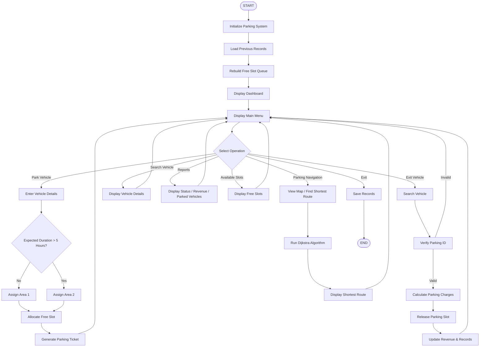

# Parking Complex Management System (C)

A console-based Parking Management System developed in C that integrates **Circular Queue**, **Weighted Graph**, **Dijkstra's Algorithm**, and **Binary File Handling** to provide efficient parking allocation, smart navigation, and persistent record management.

Project Overview

The Car Parking Management System is a console-based application developed in C Programming that automates parking slot allocation, vehicle entry and exit management, parking charge calculation, and record maintenance.

The system helps parking operators efficiently manage available parking spaces, track parked vehicles, generate parking receipts, and maintain historical records using file handling.

## Key Highlights

- 🚗 Automatic parking slot allocation using a Circular Queue
- 🅿️ Dual parking areas with automatic assignment based on expected parking duration
- 🗺️ Graph-based parking complex navigation
- 📍 Shortest route calculation using Dijkstra's Algorithm
- 💾 Persistent storage using binary file handling
- 🔐 Admin authentication for revenue reports
- 🎫 Parking ID verification before vehicle exit
- 📊 Real-time parking dashboard and status monitoring

## Objectives

- Automate parking slot allocation and management
- Reduce manual intervention in parking operations
- Provide efficient vehicle entry and exit handling
- Calculate parking charges automatically
- Maintain permanent parking records
- Improve navigation inside the parking complex using graph algorithms
- Demonstrate practical applications of Data Structures in C
- Track available and occupied parking slots
- Generate parking receipts
- Provide parking reports and revenue details

 ## Parking Complex

The parking facility consists of:

- Entrance
- Area 1 (Short-term Parking)
- Area 2 (Long-term Parking)
- Fuel Station
- Car Wash
- Garage
- Snack Store
- Accessories Shop

The locations are connected using a weighted graph to simulate real-world navigation inside the parking complex.
 
 # Features

 
 ### Parking Area Management

- Two parking zones (Area 1 and Area 2)
- Automatic area allocation based on expected parking duration
- Balanced utilization of parking spaces
  
  ---
  
# Vehicle Management
- Add new vehicle records
- Store vehicle number and owner details
- Assign parking slots automatically
- Track vehicle entry and exit time
- Search currently parked vehicles

 --- 

 ### Smart Navigation

- Visual parking complex map
- Weighted graph representation of the parking area
- Shortest route calculation using Dijkstra's Algorithm
- Navigation between parking areas and facilities
  
---

 # Parking Slot Management
- Automatic slot allocation
- Circular queue-based free slot management
- Real-time available slot tracking
- Slot reuse after vehicle exit
- Synchronization of slots after program restart

---

 # Billing System
- Calculates parking duration
- Generates automatic parking charges

  ### Security

- Parking ID verification before vehicle exit
- Admin authentication for revenue reports

  ---
  
### Parking Rates

| Vehicle Type | Charge Per Hour |
|--------------|----------------|
| Bike | Rs 20 |
| Car | Rs 50 |
| Bus | Rs 80 |
| Truck | Rs 100 |

---
## Reports

The system provides:

- Current parked vehicle list
- Parking status report
- Revenue report
- Available slot display
---

| Technology | Purpose |
|------------|---------|
| C Programming | Core development |
| Structures | Vehicle record management |
| Circular Queue | Parking slot allocation |
| Weighted Graph | Parking navigation |
| Dijkstra's Algorithm | Shortest route calculation |
| File Handling | Permanent storage |
| Time Library | Entry/Exit time management |
| Linear Search | Vehicle lookup |

---

## Data Structures & Algorithms

### Data Structures

- Structure
- Circular Queue
- Weighted Graph
- Arrays

### Algorithms

- Dijkstra's Shortest Path Algorithm
- Linear Search
- Binary File Read/Write

---

# Project Structure
## System Workflow

## Modules
# 1. Main Module

Responsible for:

User interaction
Menu display
Calling required functions
# 2. Parking Module

Handles:
 Vehicle entry
 Vehicle exit
 Searching
 Charge calculation
 Parking reports
 
# 3. Queue Module

Implements:
 Circular Queue

Used for:
 Managing free parking slots
 Efficient slot allocation
 
# 4. File Handling Module

Responsible for:

- Saving records
- Loading previous data
- Maintaining persistence

Sample Operations
Park Vehicle

Input:

Vehicle Number: UP16XY2003
Owner Name: Amit
Vehicle Type: Bike

Output:

Parking ID : 1004
Slot Number : 1
Entry Time : 19-07-2026 22:20:52
Vehicle Exit

Output:

# Parking Receipt

Receipt Number : R00001
Vehicle Number : UP16XY2003
Parking Duration : 2 Hours
Parking Charge : Rs 40
# Output Screenshots

Screenshots included in this repository demonstrate:

## Output Screenshots

- Main Dashboard
- Parking Ticket
- Vehicle Search
- Current Parked Vehicles
- Parking Status
- Revenue Report
- Parking Navigation Menu
- Parking Complex Map
- Shortest Route Navigation
- Exit Receipt
 
# Requirements
C Compiler
GCC recommended
IDE/Text Editor:
VS Code
CodeBlocks
Dev-C++

# Compilation

Using GCC:

gcc main.c parking.c queue.c file.c -o parking
Execution

Windows:

parking.exe

Linux:

./parking

---

# Challenges Faced
- Implementing circular queue correctly
- Maintaining slot consistency after restart
- Handling file storage and retrieval
- Managing vehicle history
- Calculating parking duration accurately
- Implementing Dijkstra's Algorithm in C
- Designing a weighted graph for parking navigation
- Integrating graph navigation without affecting the existing parking logic

# Future Enhancements
- Graphical User Interface (GUI)
- Database integration
- Online parking reservation
- QR-based parking tickets
- Multi-floor parking support
- User authentication
- Mobile application

---

## Learning Outcomes

Through this project, we learned:

- Modular programming in C
- Circular Queue implementation
- Weighted Graph implementation
- Dijkstra's Algorithm
- Binary file handling
- Real-time dashboard design
- Authentication techniques
- Practical software design using multiple data structures

  

---

# Conclusion

The Car Parking Management System successfully provides an automated solution for managing parking operations. It reduces manual effort, improves accuracy, and demonstrates the practical application of C programming concepts in solving real-world problems.
